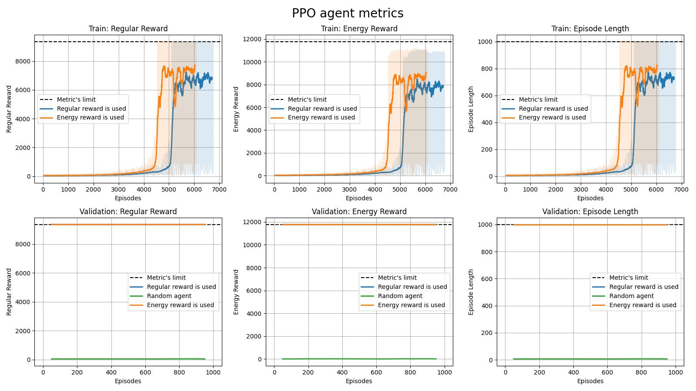
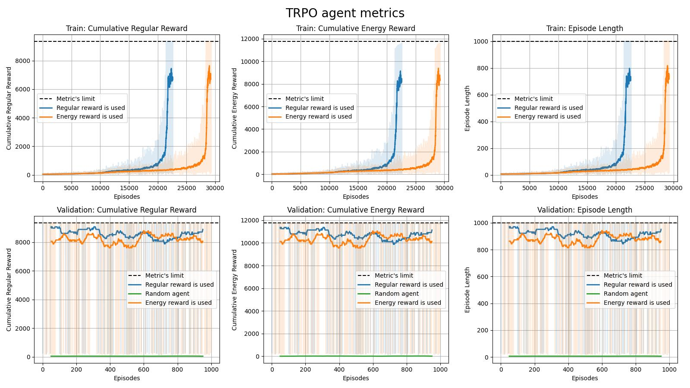

# Energy-based pendulum

The aim of the project is to compare the usage of the regular and energy-based reward applicably to the [Inverted Double Pendulum environment](https://gymnasium.farama.org/environments/mujoco/inverted_double_pendulum/).


## Installation

Before you begin, ensure that you have [Poetry](https://pypi.org/project/poetry/) installed for dependency management. It is recommended that Poetry creates a local virtual environment in your project's folder.

1. **Configure Poetry to use in-project virtual environments:**

    ```bash
    poetry config virtualenvs.in-project true
    ```

2. **Clone the repository and install dependencies:**

    ```bash
    git clone git@github.com:Makkarik/crash-course-to-reinforce.git
    cd crash-course-to-reinforce
    poetry install
    ```

## Usage

All the details of project results and algorithms implementations are listed in `Report.ipynb` file. 

You may additionally reproduce all the pipelines by launching `/src/baseline.py`, `PPO.ipynb` and `TRPO.ipynb` by yourself. The pipelines utlize the CPU for the training and inference intentionally, as there is no advantages of using thr GPU for a single-threaded environment. 

All the obtained results, including inference and training logs are saved to `/results` folder.

## Results

As nobody wants to read the whole article, we have put the results to the README file.





It is obvious that the regular reward provides better performance for the TRPO agent and faster training in terms of played episodes, while the energy-based reward is more suitable for the PPO agent. The PPO agent trained with the energy-based reward has a slightly better performance than the same agent trained with the regular reward. For the TRPO agent the case is opposite: the regular reward provides better performance than the energy-based reward.

In overall performance, the PPO agent outperforms the TRPO agent in both cases.
